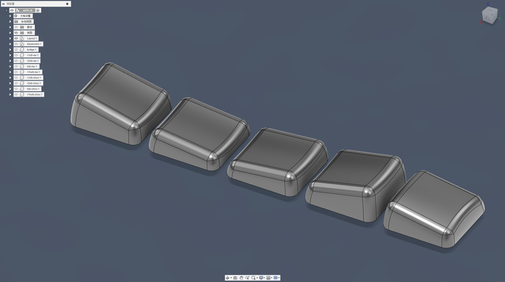
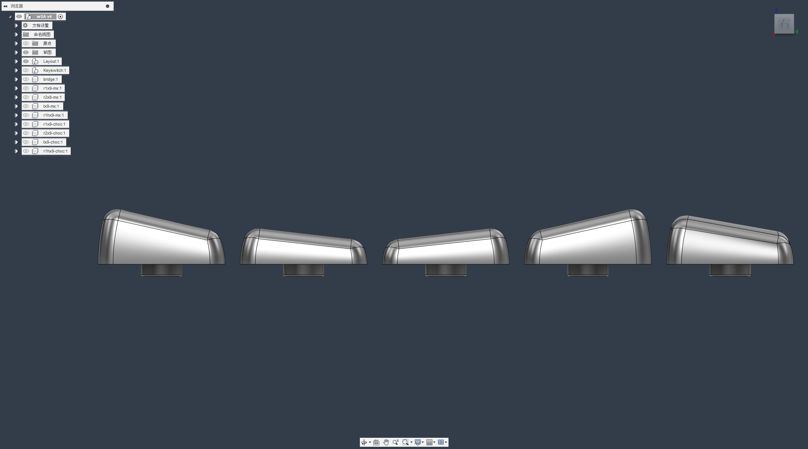
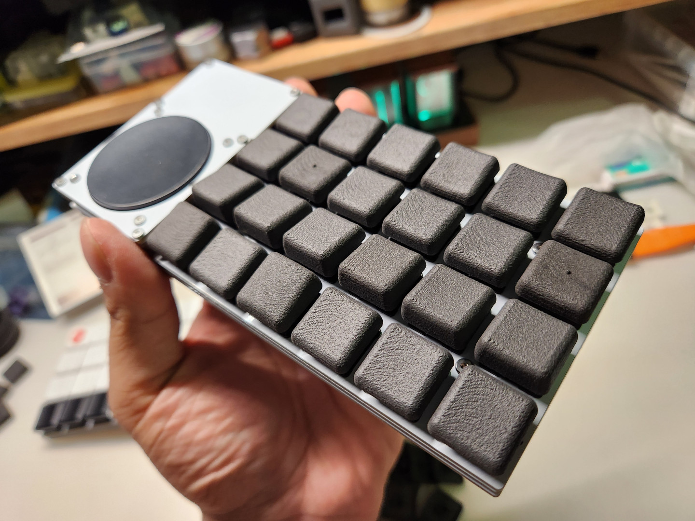
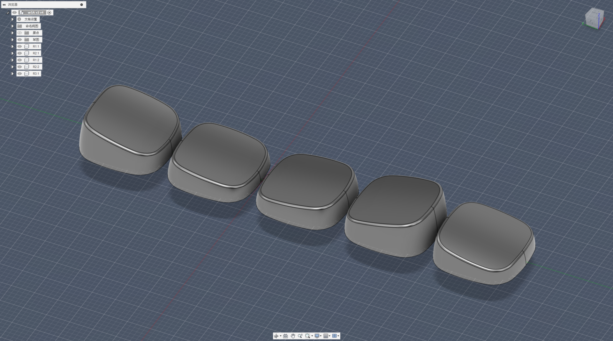

# Low Profile Concave Mirror Keycap Set

## 前言

我其實是相當喜歡球帽的人，當我還在使用MX鍵軸的時候，特別喜歡買球帽來使用，其中MDA、WDA更是讓我中意它的外表，以及它安裝之後的弧度及觸感。當KLP Lame在網上發佈的時候，我也用自己的列印機做了一份來安裝使用，更是讓居然能把鍵帽做的這麼圓滑細緻。

於是自己前前後後畫了幾次鍵帽模型，參照了先前在網上爆火的KLP Lame、Melgeek發表的MDA Profile、還有手套工作室的WDA、Nuphy家的nSA，參照個人使用分離式鍵盤時會將翻轉鍵帽來安裝的習慣，把鍵帽設計成對稱安裝的模式。

——最終產出了這套鍵帽的第一個版本。

沒錯，這套鍵帽並沒有一氣呵成就完工，第一個版本做出來之後，唯一讓我滿意的只有曲面斜度還有整體的打字手感，對我這種喜歡球帽的人來說完全不及格，於是開始研究要如何把鍵帽畫的更「圓弧」。

接著在我把Fusion的曲面功能熟悉後，完成了第二版... 但這套鍵帽沒有計算到軸體安裝時會不會卡到矮軸軸體。

於是我重新畫了一次3D模型，最終保留了第二版的圓弧作為鍵帽上半部的基礎面、下半部曲面把軸體的公差考慮進去、然後使用第一版斜度把鍵帽表面切出來，完成了最終的第三版。

再加上「凹面」的特性及「對稱」的安裝方式，將它命名為「凹面鏡（Concave Mirror）」，簡稱「CCM」。

## 大小規格

- 其實這套鍵帽只有R1、R2、T，三種大小（Profile），再根據會使用到的鍵帽大小（Unit），延伸出1u以上的長度。

- 根據現有的矮軸，分為Choc及MX十字兩種安裝軸孔。

- 並且根據現有的Gateron、Kailh兩種矮軸衛星軸軸孔孔距，搭配在6.25u的鍵帽上，兩者通用。

