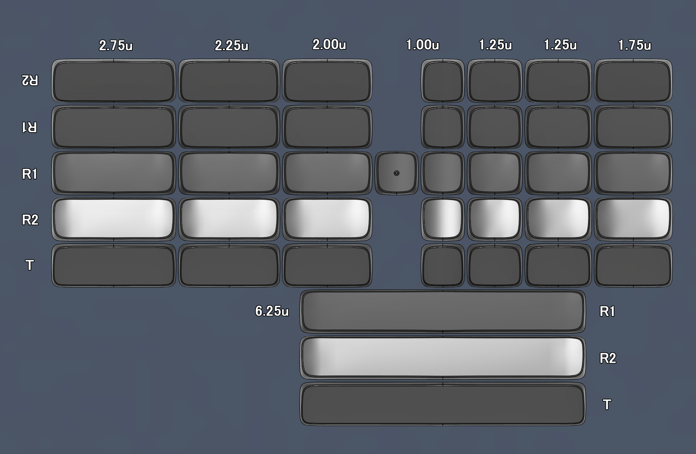

# Low Profile Concave Mirror Keycap Set

## Introduction

This is a set of keycaps that can be installed in any way you like.

- Supports both MX and Choc keyswitch.
- Supports Gateron and Kailh Low-Profile stablizer.
- The 6.25u keycaps support two different steelwire lengths.

## Inspiration

- MDA Keycaps.
- WDA Keycaps.
- LSA Keycaps.
- KLP Lame.
- We always rotate the keycaps to fit/install your split keyboard.

## Size & Profile

## MX & Choc stem

### Single stem

|||
|--|--|

### Stablizer supported

|||
|--|--|
|||

## Testing List

### MX version
||1.00u|1.25u|1.50u|1.75u|2.00u|2.25u|2.75u|6.25u|
|--|--|--|--|--|--|--|--|--|
|**R1**|✔️|❌|❌|❌|❌|❌|❌|❌|
|**R2**|✔️|❌|❌|❌|❌|❌|❌|❌|
|**T**|✔️|❌|❌|❌|❌|❌|❌|❌|

### Choc version
||1.00u|1.25u|1.50u|1.75u|2.00u|2.25u|2.75u|6.25u|
|--|--|--|--|--|--|--|--|--|
|**R1**|❌|❌|❌|❌|❌|❌|❌|❌|
|**R2**|❌|❌|❌|❌|❌|❌|❌|❌|
|**T**|❌|❌|❌|❌|❌|❌|❌|❌|

## Tools & Datasheets

- Fusion.
- KLP Switch: [PG1350](datasheet/LP%20Choc%20v1：CPG135001D01-spec.pdf) & [PG1353](datasheet/LP%20Choc%20v2：CPG135301D01-spec.pdf).
- GLP Switch: [KS-27H](datasheet/LP%20Gateron：SPEC-KS-27H10B050NN-X5.pdf).
- [GLP](datasheet/GLP-Stablizer.png) & [KLP](datasheet/KLP-Stablizer.jpg) stablizer.
- Special thanks [JLC3DP](https://jlcpcb.com/).

## Gallary

|||
|--|--|
|||
|||